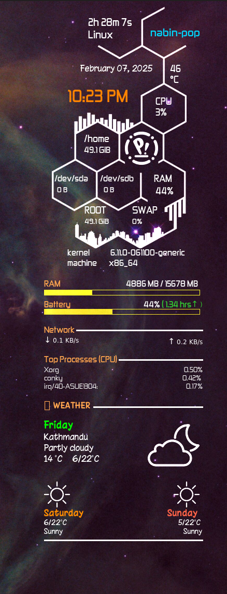

## Conky system monitor widget

This is a Conky widget for Linux that displays system information including RAM usage, battery estimated time, upload/download speeds, top processes, and weather forecasts. The top section is inspired from [this widget](https://github.com/Gictorbit/victorconky)

### Features

<table>
  <tr>
    <td>
      <ul>
        <li><b>Dynamic RAM Usage Bar</b> with color changes based on usage percentage.</li>
        <li><b>Battery Estimated Time</b> with charging/discharging status and remaining time.</li>
        <li><b>Network Speeds</b> showing current upload and download speeds.</li>
        <li><b>Top Processes</b> consuming system resources.</li>
        <li><b>Weather Forecast</b> for 3 days and max & min temperatures</li>
      </ul>
    </td>
    <td>
      
    </td>
  </tr>
</table>

### Installation

1. Clone this repository

   ```bash
   git clone https://github.com/nabin25/conky-ultimate-widget.git
   ```

   ````bash
   cd conky-ultimate-widget```
   ````

2. Install Dependencies

   ```bash
   sudo apt install conky-all jq curl
   ```

3. Make Scripts Executable

   ```bash
   chmod +x scripts/*.sh
   ```

4. Add necessary fonts

   ```bash
   sudo apt install ttf-droid fonts-dejavu
   ```

   Also install both fonts from fonts folder of this repository

5. Start conky

   ```bash
   conky -c main-widget
   ```

### Customization

- To enter location, open weather-icon.sh file and add change location in _curl_ command url. Also change the time zone accordingly in the same file.

- If network speeds are not being displayed run the below command to see the device for wifi type.

  ```bash
  nmcli device status
  ```

  Then replace **_wlo1_** with the one that is displayed there in **main-widget** network section.

- Display the widget at various positions in the desktop by changing **_alignment_** value in **_main-widget_** file

- To use the widget on startup create a script. Add `conky -c ./path/to/main_widget` make it executable and then browse to startup applications and select the script
